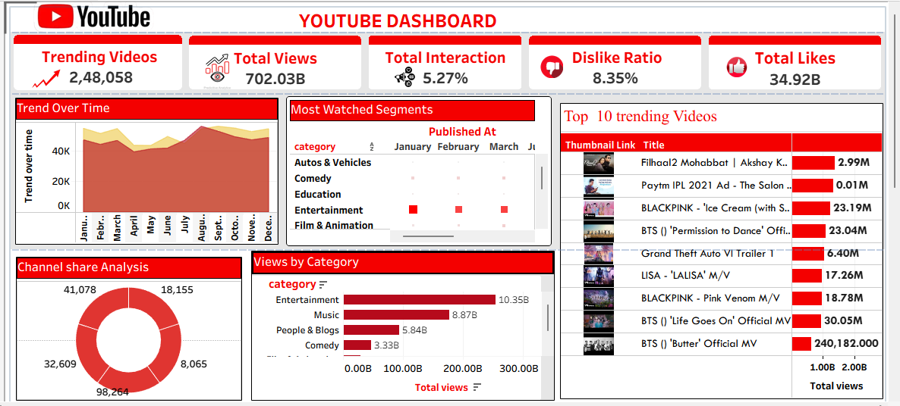

# YouTube Data Analytics Dashboard

## 📊 Project Overview
This project focuses on analyzing YouTube trending videos dataset to uncover insights about viewer engagement, popular categories, and video performance metrics. The final dashboard provides an interactive way to explore key performance indicators (KPIs) like total views, interactions, and trending patterns.

## 🛠️ Tools Used
* **Data Visualization:** Power BI
* **Data Source:** YouTube Trending Videos Dataset

## 📈 Key Features & Insights Visualized
* **Top KPIs:** Tracks Total Views, Total Interactions, Dislike Ratio, and Total Likes at a glance.
* **Trend Over Time:** Area chart showing how video views fluctuate across different months.
* **Category Breakdown:** Donut chart and Bar chart highlighting the dominant categories (e.g., Entertainment, Music).
* **Top 10 Trending Videos:** A detailed tabular view displaying the most popular videos along with their view counts.

## 🖼️ Dashboard Preview

